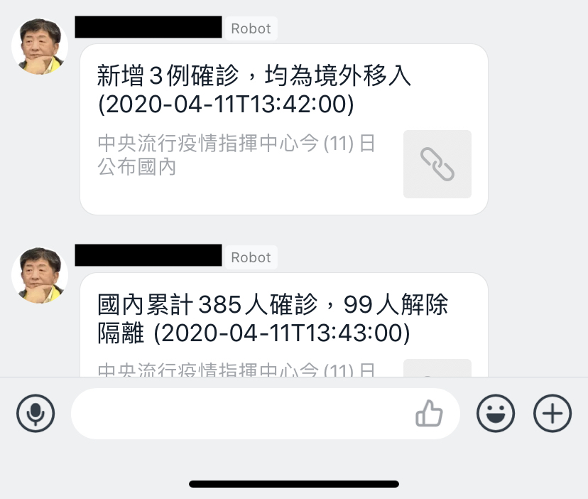

# Sending Notification of CDC News

Implemention of subsrcription to CDC (Taiwan Centers for Disease Control), and sending notification via webhook.

## Requirements

- Node.js v12
- A webhook to a message tool, such as slack and telegram.

## Prepare Local Development Configurations

- Copy `.example.env` and rename it to `.env`
- Adjust the config depends on your case

```
$ cp .example.env .env
$ vim .env
```

## Install dependencies

In your project root directory

```
npm install
```

## Execute

```
node index.js
```

## Results


